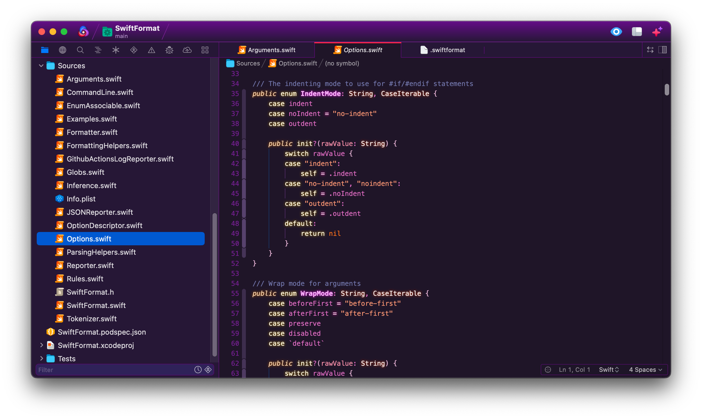

**SwiftFormat** provides integration with Nick Lockwood's [SwiftFormat](https://github.com/nicklockwood/SwiftFormat). The extension will run the formatter when you save a Swift document. It can alternatively be invoked as an editor command. 

<!--
🎈 It can also be helpful to include a screenshot or GIF showing your extension in action:
-->

## Requirements

SwiftFormat includes a built-in version of the formatter. If you would like to use a different version you can customize the extension with a path to your own version in settings. You might want to do this if you work on a team and want to ensure that everyone is using a particular version.

## Usage
SwiftFormat runs any time you save a Swift document, automatically reformatting the Swift according to the default SwiftFormat [rules](https://github.com/nicklockwood/SwiftFormat#rules). You can customize these in a `.swiftformat` [config file](https://github.com/nicklockwood/SwiftFormat#config-file) in the root of your project. 

To run SwiftFormat manually:

- Select the **Editor → SwiftFormat** menu item; or
- Open the command palette and type `SwiftFormat`

### Configuration
To configure global preferences, open **Extensions → Extension Library...** then select SwiftFormat's **Settings** tab.

You can also configure preferences on a per-project basis in **Project → Project Settings...**

